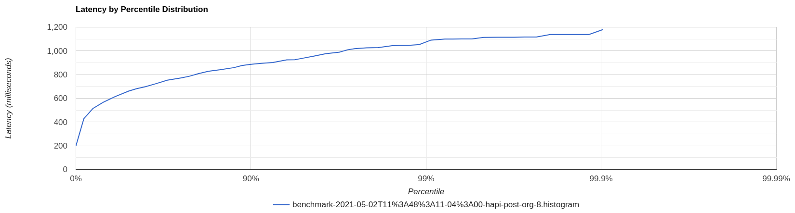

# FHIR Benchmarks

[](./workflows/rust_basics.yml)

The FHIR landscape is expanding and maturing rapidly.
Users now have many great FHIR server implementation options to choose between.

This project aims to help with those choices by
  measuring the performance of FHIR server implementations,
  via a set of repeatable and isolated benchmarks that capture:

* How they perform under different levels of load/concurrency.
* How they perform with sample data sets of different sizes.
* The success-to-failure ratio of various operations.
* The throughput of various operations,
    i.e. responses per second.
* The latency of various operations,
    i.e. how many milliseconds per response.
    * The latency at various percentiles,
        e.g. "100% of responses take less than Z milliseconds",
        "99.9% of responses take less than Y milliseconds",
        "50% of responses take less than X milliseconds (i.e. the median latency)",
        etc.
    * Graph the overall latency percentile distribution,
        as an [HDR Histogram](http://www.hdrhistogram.org/).

Each round of benchmarking will be run periodically and published publicly,
  allowing users to see the relative performance of various FHIR servers
  and FHIR server implementers to gauge (and improve!) their server's performance.

For now, though, the benchmarks are still being built out
  and everything has to be run locally.
Here's an example captured from an i7 laptop
  (trimmed here for size, with full results here:
  [./results/benchmark-2021-05-02T11:48:11-04:00.json](./results/benchmark-2021-05-02T11:48:11-04:00.json)):

```javascript
{
  "started": "2021-05-02T15:48:30.965398190Z",
  "completed": "2021-05-02T15:58:19.152101257Z",
  "config": {
    "iterations": 1000,
    "operation_timeout": 10000,
    "concurrency_levels": [
      1,
      8
    ],
    "population_size": 1000
  },
  "benchmark_metadata": {
    "cargo_profile": "release",
    "git_branch": "main",
    "git_semver": "0.1.0",
    "git_sha": "3216f9d0442062fdb369a8003214cfcecd57e8b9",
    "cpu_core_count": 4,
    "cpu_brand_name": "Intel(R) Core(TM) i7-8550U CPU @ 1.80GHz",
    "cpu_frequency": 2944
  },
  "servers": [
    {
      "server": "HAPI FHIR JPA Server",
      "launch": {
        "started": "2021-05-02T15:48:30.965417921Z",
        "completed": "2021-05-02T15:48:57.382738044Z",
        "outcome": {
          "Ok": []
        }
      },
      "operations": [
        {
          "operation": "metadata",
          "errors": [],
          "measurements": [
            {
              "concurrent_users": 1,
              "started": "2021-05-02T15:48:57.382792340Z",
              "completed": "2021-05-02T15:49:07.515565037Z",
              "execution_duration": "PT10.132772697S",
              "iterations_failed": 0,
              "iterations_skipped": 0,
              "metrics": {
                "throughput_per_second": 98.69719699960521,
                "latency_millis_mean": 9.546000000000001,
                "latency_millis_p50": 8,
                "latency_millis_p90": 14,
                "latency_millis_p99": 28,
                "latency_millis_p999": 47,
                "latency_millis_p100": 54,
                "latency_histogram": "HIS...",
                "latency_histogram_hgrm_gzip": "H4s..."
              }
            },
            {
              "concurrent_users": 8,
              "started": "2021-05-02T15:49:07.516563730Z",
              "completed": "2021-05-02T15:49:13.224813471Z",
              "execution_duration": "PT5.708249741S",
              "iterations_failed": 0,
              "iterations_skipped": 0,
              "metrics": {
                "throughput_per_second": 175.1927119831815,
                "latency_millis_mean": 44.74900000000001,
                "latency_millis_p50": 32,
                "latency_millis_p90": 96,
                "latency_millis_p99": 178,
                "latency_millis_p999": 253,
                "latency_millis_p100": 256,
                "latency_histogram": "HIS...",
                "latency_histogram_hgrm_gzip": "H4s..."
              }
            }
          ]
        },
        {
          "operation": "POST /Organization",
          "errors": [],
          "measurements": [
            {
              "concurrent_users": 1,
              "started": "2021-05-02T15:49:13.225452642Z",
              "completed": "2021-05-02T15:51:25.804463831Z",
              "execution_duration": "PT132.579011189S",
              "iterations_failed": 0,
              "iterations_skipped": 0,
              "metrics": {
                "throughput_per_second": 7.542672670634113,
                "latency_millis_mean": 131.73300000000006,
                "latency_millis_p50": 114,
                "latency_millis_p90": 211,
                "latency_millis_p99": 415,
                "latency_millis_p999": 569,
                "latency_millis_p100": 596,
                "latency_histogram": "HIS...",
                "latency_histogram_hgrm_gzip": "H4s..."
              }
            },
            {
              "concurrent_users": 8,
              "started": "2021-05-02T15:51:25.804745569Z",
              "completed": "2021-05-02T15:52:48.935967768Z",
              "execution_duration": "PT83.131222199S",
              "iterations_failed": 0,
              "iterations_skipped": 0,
              "metrics": {
                "throughput_per_second": 12.029206914388133,
                "latency_millis_mean": 660.779,
                "latency_millis_p50": 661,
                "latency_millis_p90": 887,
                "latency_millis_p99": 1053,
                "latency_millis_p999": 1138,
                "latency_millis_p100": 1180,
                "latency_histogram": "HIS...",
                "latency_histogram_hgrm_gzip": "H4s..."
              }
            }
          ]
        }
      ],
      "shutdown": {
        "started": "2021-05-02T15:52:48.936505725Z",
        "completed": "2021-05-02T15:52:58.651353354Z",
        "outcome": {
          "Ok": []
        }
      }
    },
    {
      "server": "Spark FHIR R4 Server",
      "launch": {
        "started": "2021-05-02T15:52:58.651370084Z",
        "completed": "2021-05-02T15:53:05.995005440Z",
        "outcome": {
          "Ok": []
        }
      },
      "operations": [
        {
          "operation": "metadata",
          "errors": [],
          "measurements": [
            {
              "concurrent_users": 1,
              "started": "2021-05-02T15:53:05.995043181Z",
              "completed": "2021-05-02T15:55:14.969830444Z",
              "execution_duration": "PT128.974787263S",
              "iterations_failed": 0,
              "iterations_skipped": 0,
              "metrics": {
                "throughput_per_second": 7.753500705568564,
                "latency_millis_mean": 128.38500000000008,
                "latency_millis_p50": 126,
                "latency_millis_p90": 142,
                "latency_millis_p99": 169,
                "latency_millis_p999": 221,
                "latency_millis_p100": 272,
                "latency_histogram": "HIS...",
                "latency_histogram_hgrm_gzip": "H4s..."
              }
            },
            {
              "concurrent_users": 8,
              "started": "2021-05-02T15:55:14.970228943Z",
              "completed": "2021-05-02T15:56:06.243876693Z",
              "execution_duration": "PT51.273647750S",
              "iterations_failed": 0,
              "iterations_skipped": 0,
              "metrics": {
                "throughput_per_second": 19.503442357576112,
                "latency_millis_mean": 409.0240000000002,
                "latency_millis_p50": 329,
                "latency_millis_p90": 458,
                "latency_millis_p99": 1701,
                "latency_millis_p999": 6027,
                "latency_millis_p100": 6027,
                "latency_histogram": "HIS...",
                "latency_histogram_hgrm_gzip": "H4s..."
              }
            }
          ]
        },
        {
          "operation": "POST /Organization",
          "errors": [],
          "measurements": [
            {
              "concurrent_users": 1,
              "started": "2021-05-02T15:56:06.244311222Z",
              "completed": "2021-05-02T15:57:38.059490926Z",
              "execution_duration": "PT91.815179704S",
              "iterations_failed": 0,
              "iterations_skipped": 0,
              "metrics": {
                "throughput_per_second": 10.891466535969068,
                "latency_millis_mean": 81.133,
                "latency_millis_p50": 80,
                "latency_millis_p90": 83,
                "latency_millis_p99": 91,
                "latency_millis_p999": 143,
                "latency_millis_p100": 707,
                "latency_histogram": "HIS...",
                "latency_histogram_hgrm_gzip": "H4s..."
              }
            },
            {
              "concurrent_users": 8,
              "started": "2021-05-02T15:57:38.059819608Z",
              "completed": "2021-05-02T15:58:16.476148193Z",
              "execution_duration": "PT38.416328585S",
              "iterations_failed": 0,
              "iterations_skipped": 0,
              "metrics": {
                "throughput_per_second": 26.030820491461892,
                "latency_millis_mean": 229.30200000000005,
                "latency_millis_p50": 225,
                "latency_millis_p90": 243,
                "latency_millis_p99": 329,
                "latency_millis_p999": 1128,
                "latency_millis_p100": 1128,
                "latency_histogram": "HIS...",
                "latency_histogram_hgrm_gzip": "H4s..."
              }
            }
          ]
        }
      ],
      "shutdown": {
        "started": "2021-05-02T15:58:16.476502779Z",
        "completed": "2021-05-02T15:58:19.152087251Z",
        "outcome": {
          "Ok": []
        }
      }
    }
  ]
}
```

It's worth noting that, for most servers,
  the latency distribution between p50 and p100 will be quite wide.
It can be very helpful to visualize that distribution as an
  [HDR Histogram](http://www.hdrhistogram.org/).
For example, let's create one for HAPI's "POST /Organization" operation,
  above, at 8 concurrent users:

1. Run this command to extract the histogram data to a separate `.hdrh` file:
    
    ```
    $ jq --raw-output \
        '.servers | .[] | select(.server == "HAPI FHIR JPA Server") | .operations | .[] | select(.operation == "POST /Organization") | .measurements | .[] | select(.concurrent_users == 8) | .metrics.latency_histogram' \
        ./results/benchmark-2021-05-02T11\:48\:11-04\:00.json \
        > ./results/benchmark-2021-05-02T11\:48\:11-04\:00-hapi-post-org-8.hdrh
    ```
    
2. Upload that file to the histogram viewer widget from
     [HdrHistogramJS](https://github.com/HdrHistogram/HdrHistogramJS) here:
     <https://hdrhistogram.github.io/HdrHistogramJSDemo/plotFiles.html>.
3. Enjoy the informative chart!
   


## So What's Next?

Some of the most immediate next steps include:

* Adding a web site that results will be published to.
* Adding support for benchmarking additional operations, e.g. `Patient` writes, reads, and searches.
* Adding support for additional FHIR servers, e.g. [IBM FHIR Server](https://ibm.github.io/FHIR/).
* Adding infrastructure and automation to run the benchmarks periodically and automatically.


## How Do I Run the Benchmarks Myself?

The benchmark orchestrator and operations are all written in [Rust](https://www.rust-lang.org/),
  which run against locally hosted FHIR servers run as Docker containers,
  using sample data generated via [Synthea](https://synthetichealth.github.io/synthea/).

First, ensure you have installed the following prerequisites:

* [Rust](https://www.rust-lang.org/) >= v1.51.0, as installed via [rustup](https://www.rust-lang.org/learn/get-started).
* [Docker](https://www.docker.com/) >= v20.10.6
* [Docker Compose](https://docs.docker.com/compose/) >= v1.27.4
* (Ubuntu only) install `libssl-dev`

Then, run these commands to clone, build, and run the benchmark suite's tests:

```shell
$ git clone https://github.com/karlmdavis/fhir-benchmarks.git
$ cd fhir-benchmarks
$ # Build in debug mode and run tests:
$ cargo test
$ # Build in release mode and run benchmarks:
$ cargo run --release \
  | tee ./results/results-release-$(date --iso-8601=seconds).json
```

Both the tests and the benchmarks themselves will automatically build the Docker containers for the FHIR servers and Synthea, as needed.

Or to run the benchmarks with a customized config (see the defaults in [./fhir-bench-orchestrator/src/config.rs](./fhir-bench-orchestrator/src/config.rs)):

```shell
$ FHIR_BENCH_ITERATIONS=1000 \
  FHIR_BENCH_CONCURRENCY_LEVELS=1,2,8 \
  FHIR_BENCH_POPULATION_SIZE=1000 \
    cargo run --release \
    | tee ./results/results-release-$(date --iso-8601=seconds).json
```


## How Can I Contribute to this Effort?

If you'd like to add support for a new FHIR server, additional operations,
  or otherwise help to build out these benchmarks,
  you'd be very welcome!
Please see [CONTRIBUTING.md](./CONTRIBUTING.md) for further details.
